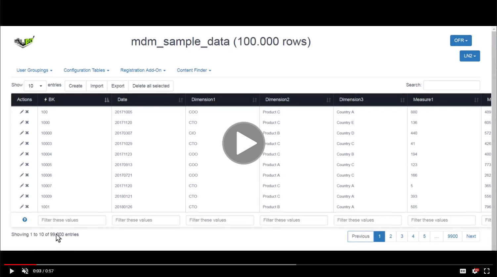
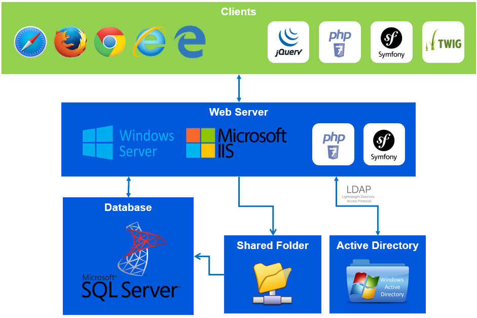

### PIT Business
This content is part of a library of solutions build by PIT Business based on the experience of its experts.<br>
Please visit [PIT Business Website](http://www.pit-business.com) to **discover our Services and Solutions** for Scorecard, Stratgy Map, Master Data Management, BI Catalog, BI ChatBot, Project Portfolio Management, Dependency Graphs, ...<br>
*PIT Business, the best Qlik Influence Partner in Luxembourg & Belgium.*<br>

# Master Data Manager
This solution is a **user interface plugged on a database schema** that allows to **manage tables content**.<br>
The user navigates between multiple tables via custom Menus, and displays data in a **really efficient** way thanks to paginated queries. Classical **Create**, **Update** and **Delete** functions can be performed **row by row**, or **massively** thanks to **Import**, **Export** and **Delete all selected** features. Selections are done with some 1-column **filters**, or with a all-columns filter. Interface is accessible via a login screen, where the **security** is checked with **Windows AD** and the user obtains a **Read**, **Write** or **Admin** role.<br>
[](https://drive.google.com/file/d/1K6vq7hg0fNSlUcyiB98MaFzOOW0gdlqw/preview)<br>

## Which challenges does it address?

**BICC/IT**
 - When BICC/IT needs to manage content of configuration tables inside database and to perform massive INSERT/MERGE effectively
 - For BICC/IT to provide an easy to use UI and keep control on security to business users

**Business Users**
- When business users need to edit data inside database tables bypassing challenges with SQL knowledge, Tool installation, Connection information, Security management

## Versions

Version: 1.3
  -  Multiple connections to Microsoft SQL Server
  -  Columns order defined in configuration file
  -  Possibility to hide some technical columns with configuration file
  -  Define some Foreign Keys in configuration file that will link to destination table
  -  Define extra links in configuration file according to row data
  -  User's authentication in Windows AD

Version: 1.2
  -  Filter data column by column
  -  Filter data on multiple columns
  -  Sort data column by column
  -  Export all data displayed in a CSV file
  -  Delete all displayed data according to filters
  -  Import all data from a CSV file, Insert news record and Merge existing records based on Primary Key
  -  Possibility to link a column to a language, and display only the column linked to the user's language

Version: 1.1
  -  Connection to Microsoft SQL Server
  -  Configuration file to define tables' structure
  -  Listing tables in custom Menus
  -  Listing data in table
  -  Data pagination
  -  Create form to add a record
  -  Update form to edit a record
  -  Delete link and confirmation for one record

## Architecture
<br>
Techonologies: PHP, Symfony, HTML, CSS, JavaScript, JQuery, TWIG, Windows SQL Server, T-SQL, Windows AD, LDAP.

### Quick installation
This Master Data Manager solution is not available Open Source, please [contact PIT Business](http://www.pit-business.com) to get the MDM Solution.<br>

1. Install IIS >= 8.0 on Windows Server >= 2012
2. Install PHP >= 7.0 on Windows Server >= 2012
3. Deploy MDM source code on the Windows Server
4. Create the IIS Website linked to the MDM source code
5. Edit the YML configuration files

**parameters.yml**<br>
```yml
parameters:
    database_host: hostname
    database_port: 1433
    database_name: db
    database_schema: dbo
    database_user: sa
    database_password: ********
    import.directory: '\\shared_path\upload'
    export.delimiter: '||'
```
<br>
**tables_metadata.yml**<br>
```yml
table1_name_in_db:
  displayName: Table1 Name
  column_pk:
    displayName: 'Primary Key'
    identifier: true
  column_fk:
    displayName: 'My Foreign Key'
    identifier: false
    fk:
      table: destination_table_in_db
      property: destination_col_in_table
      labelProperty: destination_col_to_display
  name_en:
    nullable: true
    displayName: 'Name EN'
    language: EN
  name_nl:
    displayName: 'Name NL'
    language: NL
  name_fr:
    nullable: true
    displayName: 'Name FR'
    language: FR
  creation_date:
    visibleListing: true
    visibleForm: false
```
----------

### Copyright
Licensed under the GNU AGPLv3<br>
*Strongest copyleft license are conditioned on making available complete source code of licensed works and modifications, which include larger works using a licensed work, under the same license. Copyright and license notices must be preserved. Contributors provide an express grant of patent rights. When a modified version is used to provide a service over a network, the complete source code of the modified version must be made available.*<br>
Information about the license at https://choosealicense.com/licenses/agpl-3.0<br>
<br>
For commercial use, contact us via [PIT Business Website](http://www.pit-business.com)<br>
Copyright 2018 PIT Business SARL<br>
